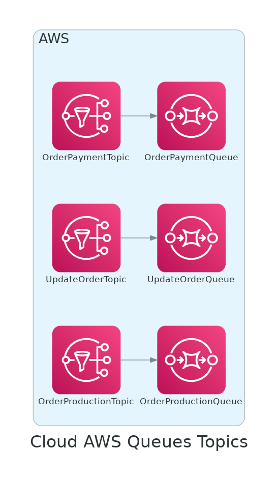

# Queues & Topics IaC

Repository responsible to provisioning the queues and topics.

# Local Development

## Requirements

- [Terraform](https://www.terraform.io/downloads.html)
- [Terraform Docs](https://github.com/terraform-docs/terraform-docs)
- [AWS CLI](https://aws.amazon.com/cli/)
- [Python 3](https://www.python.org/downloads/)

## Manual deployment

### Attention

Before deploying the queues and topics, make sure to set the `AWS_ACCESS_KEY_ID` and `AWS_SECRET_ACCESS_KEY` environment variables.

Be aware that this process will take a few minutes (~2 minutes) to be completed.

To deploy the queues and topics manually, run the following commands in order:

```bash
make init
make check # this will execute fmt, validate and plan
make apply
```

To destroy the queues and topics, run the following command:

```bash
make destroy
```

## Automated deployment

The automated deployment is triggered by a GitHub Action.

# Diagram of the complete infrastructure



## Terraform

Bellow it is described all the resources used to create the architecture proposed for this project.

<!-- BEGIN_TF_DOCS -->

## Requirements

| Name | Version |
|------|---------|
| <a name="requirement_terraform"></a> [terraform](#requirement\_terraform) | 1.7.4 |
| <a name="requirement_aws"></a> [aws](#requirement\_aws) | 5.38.0 |
## Providers

No providers.
## Inputs

| Name | Description | Type | Default | Required |
|------|-------------|------|---------|:--------:|
| <a name="input_region"></a> [region](#input\_region) | The default region to use for AWS | `string` | `"us-east-1"` | no |
| <a name="input_tags"></a> [tags](#input\_tags) | The default tags to use for AWS resources | `map(string)` | <pre>{<br>  "App": "queue_topic"<br>}</pre> | no |
## Modules

| Name | Source | Version |
|------|--------|---------|
| <a name="module_order_payment"></a> [order\_payment](#module\_order\_payment) | ./modules/queue_topic | n/a |
| <a name="module_order_production"></a> [order\_production](#module\_order\_production) | ./modules/queue_topic | n/a |
| <a name="module_update_order"></a> [update\_order](#module\_update\_order) | ./modules/queue_topic | n/a |
## Resources

No resources.
## Outputs

No outputs.
<!-- END_TF_DOCS -->